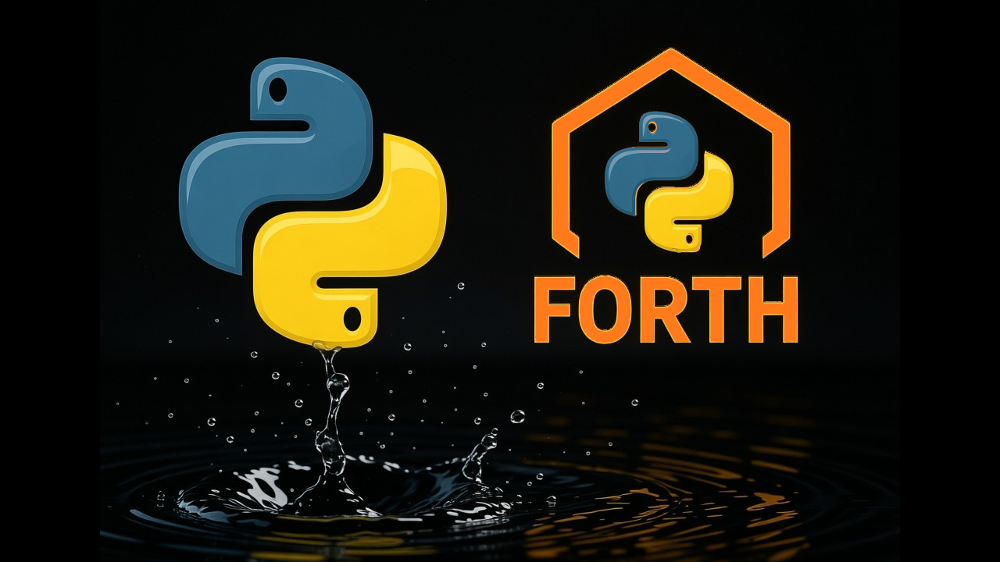

#  `FORTH` 0.0.1
## minimal script language model in Python

(c) Dmitry Ponyatov <<dponyatov@gmail.com>> 2025 MIT

github: https://github.com/ponyatov/FORTH

## video tutorial

https://rutube.ru/plst/1226139

