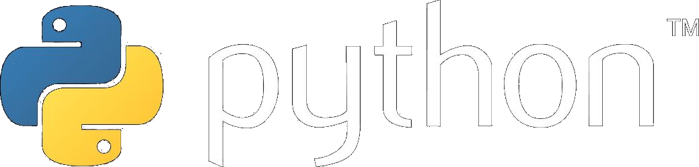

### 05: Why Python?
#### Зачем Python?

- simple and very readable syntax
- high-speed prototyping: from idea for working code
- REPL: interactive developmed and incremental testing
- huge amount of popular libraries for anything you can imagine

## subtitles
### ru

Python — один из лучших языков для обучения и прототипирования благодаря своему
простому синтаксису, и высокой скорости разработки. Он позволяет быстро
переходить от идеи к рабочему коду.

Для новичка Python предлагает ряд преимуществ:
- низкий порог входа
- командная строка и прямая интерпретация кода без компиляции
- динамическая типизация: не требуется объявлять типы на каждую функцию и
  переменную, что в том числе улучшает читаемость кода (меньше синтаксического
  шума)
- огромное сообщество, и база учебных и справочных материалов
- готовые библиотеки для всего что только можно представить
- компактность кода: требуется меньше строк кода, чем на многих других языках

Из недостатков Pythonмощно отметить:
- необходимость установки интерпретатора, вместо запуска единственного
  исполняемого файла
- недоступность на устройствах IoT и автоматики на базе микроконтроллеров
