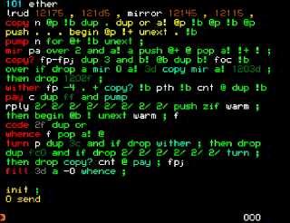

### 06: Why FORTH?
#### Зачем Форт?

- extra simple, no-syntax language
- fast and easy to rewrite from scratch
- really tiny hardware requirements allows to use as MCU console

## subtitles
### ru

Язык Форт обладает рядом уникальных достоинств, которые делают его эффективным
инструментом в специфических областях, несмотря на то, что он не получил
массового распространения.

Внутренняя простота и минимализм: Ядро Форта очень компактно (может занимать
8-16 килобайт), а вся программа состоит только из двух синтаксических элементов:
целые числа, и слова.

- слово это любая группа непробельных символов (включая знаки препинания)
- базовый синтаксис Форта сводится всего к одному правилу: слова и числа в
программе разделяются пробелами

Фактически, синтаксиса у Форта нет: если вы пишете свою форт-систему, вам нужен
только лексер, который умеет отличать числа. Нет никаких других конструкций,
операторов, сложных правил о структуре и порядке элементов программы. Вам нужно
только две функции:
- выделение группы любых символов до следующего пробела
- и проверка этой группы, не является ли она записью целого числа

Высокая эффективность: Получаемый код по объему и скорости работы почти не
уступает ассемблеру, что делает Форт отличным кандидатом там, где критичны
ресурсы, но при этом нужен диалоговый режим работы: ввод команд пользователем, и
ручная компиляция кода мелкими фрагментами.

Форт отличается гибкостью, высокой адаптируемостью, и простотой реализации.
Благодаря свой внутренней простоте, граничащей с вырожденностью, Форт очень
просто написать самому. В сообществе форт-программистов вообще считается что
каждый квалифицированный фортёр должен написать себе свою собственную
форт-систему, максимально заточенную на личные предпочтения и решаемые задачи.
